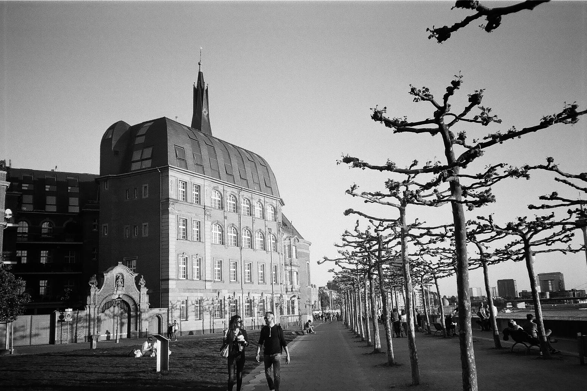
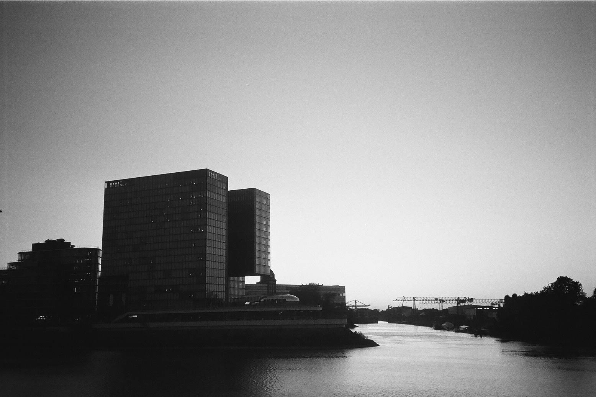
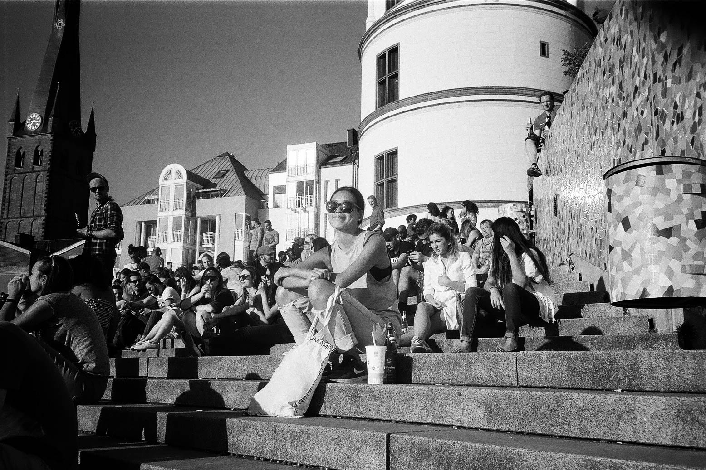
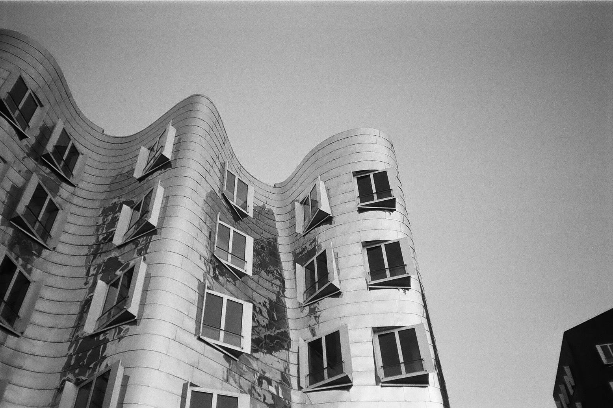
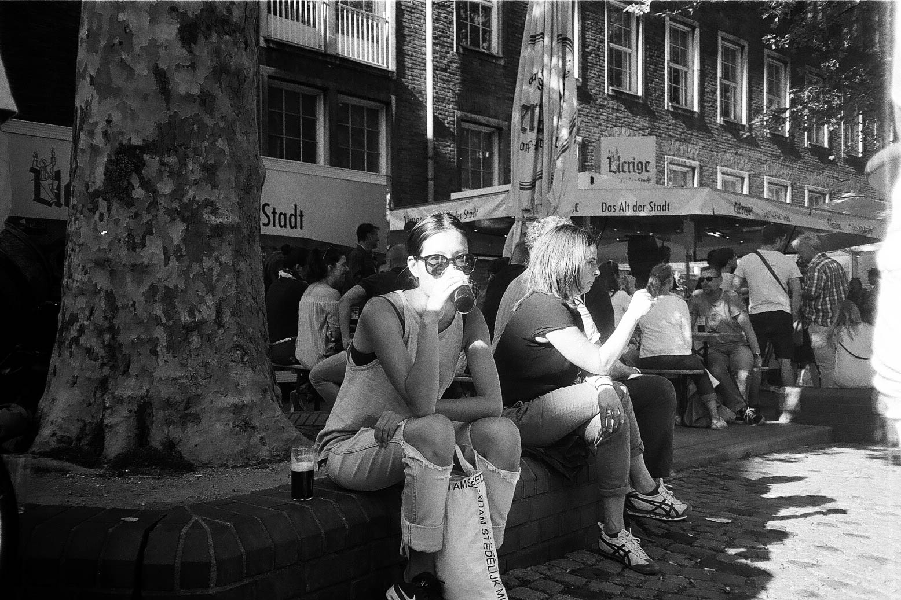
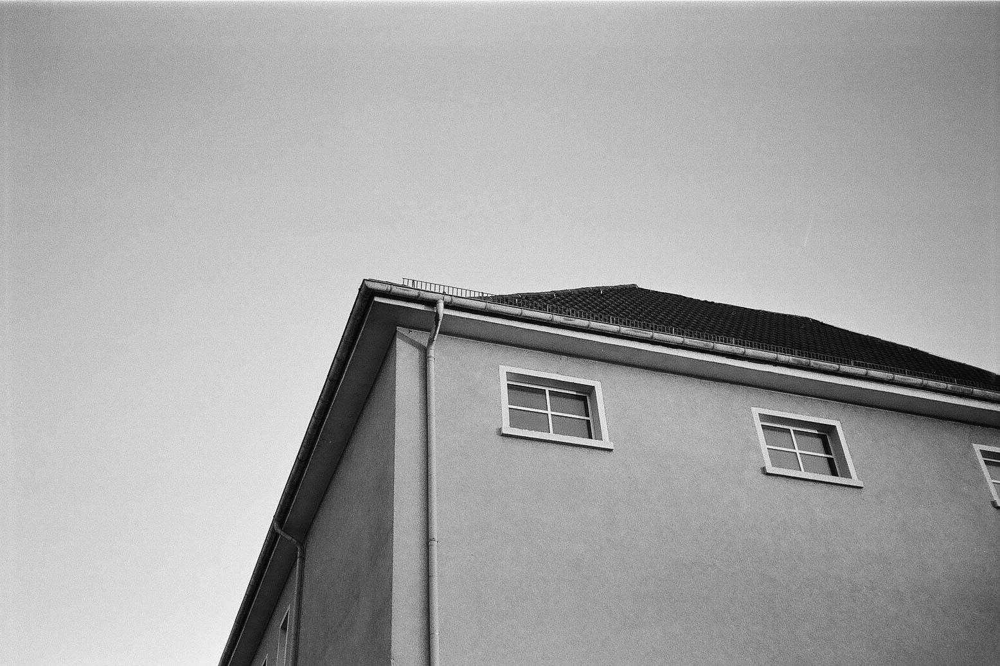
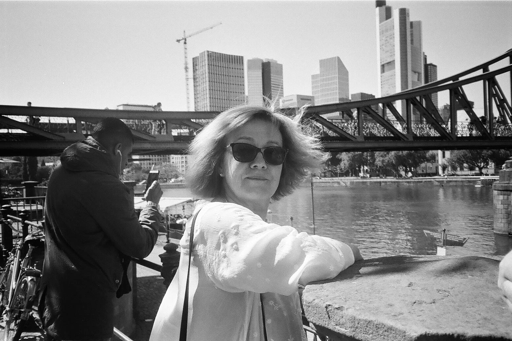
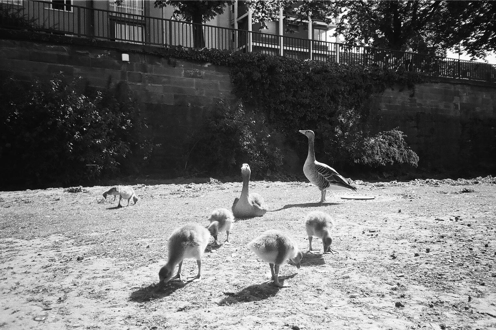
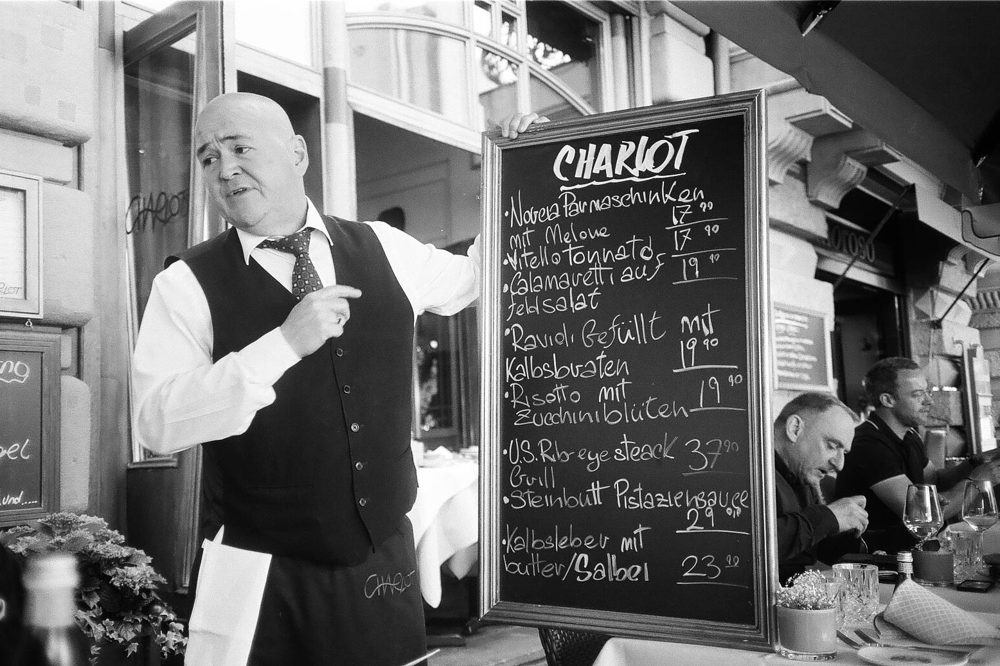
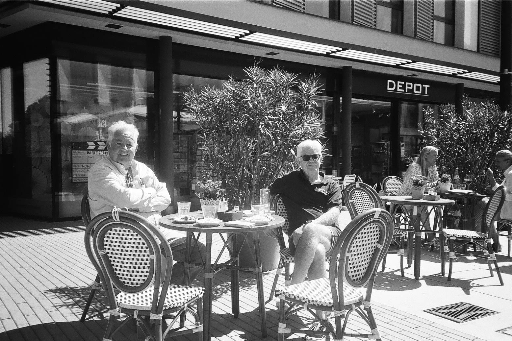

<!-- Dusseldorf -->

## Dusseldorf, Germany

## Dusseldorf, Germany

## Dusseldorf, Germany

## Dusseldorf, Germany

## Dusseldorf, Germany

## Dusseldorf, Germany

<!-- Frankfurt -->

## Frankfurt, Germany

## Frankfurt, Germany

## Frankfurt, Germany

<!-- ## Frankfurt, Germany -->

## Frankfurt, Germany

## Frankfurt, Germany

## Jason & Olga's wedding

## Jason & Olga's wedding

 

For a bit of fun, I picked up a [Canon MC](http://camera-wiki.org/wiki/Canon_MC)
at a flea market in Dusseldorf, Germany. This is the first roll of film that was
shot with it. The film used is [Ilford HP5
Plus](https://www.google.com/search?q=ilford+hp5&ie=utf-8&oe=utf-8&client=firefox-b-ab).

