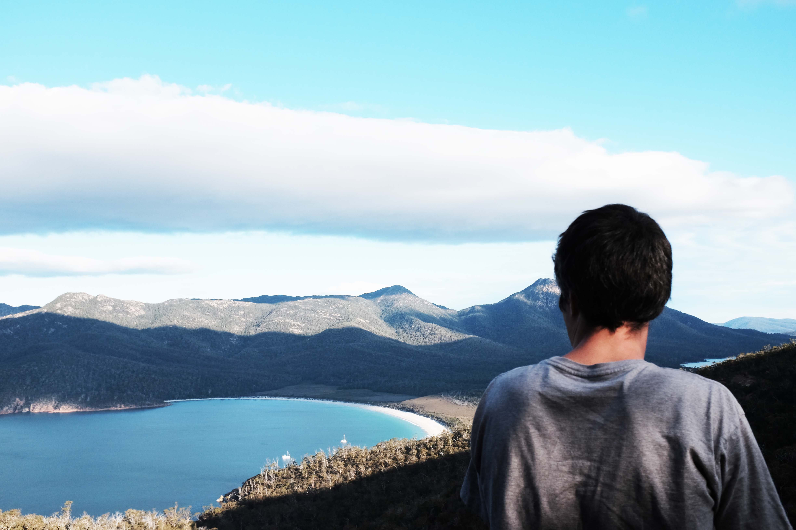
## Wineglass Bay Lookout

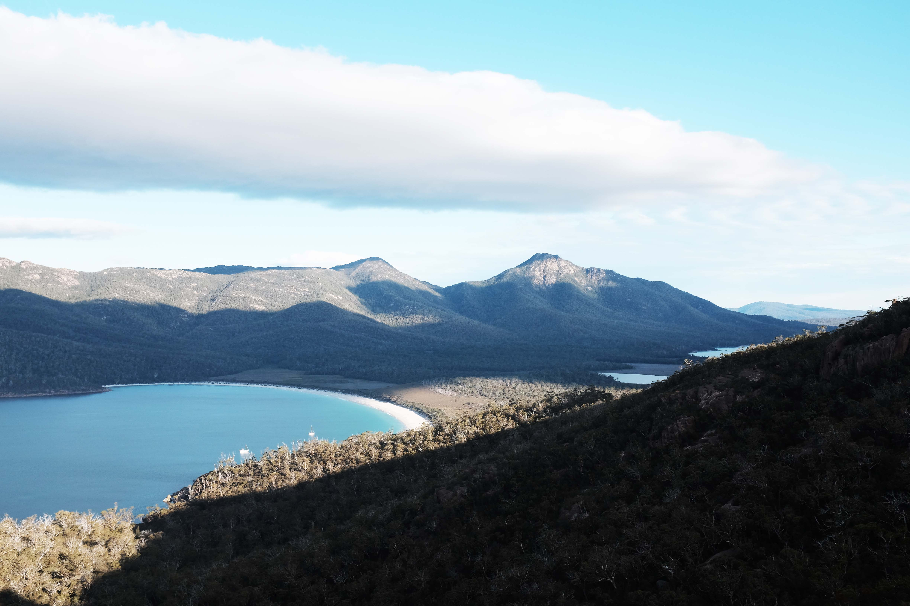
## Wineglass Bay Lookout

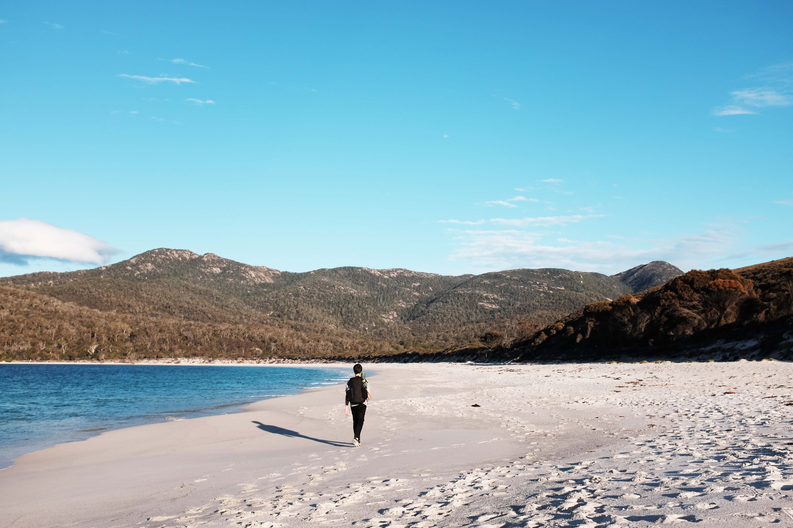
## Wineglass Bay Campground

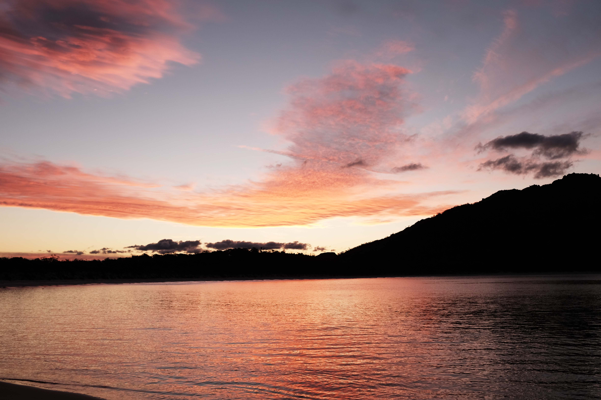
## Wineglass Bay Campground

## Mt Freycinet

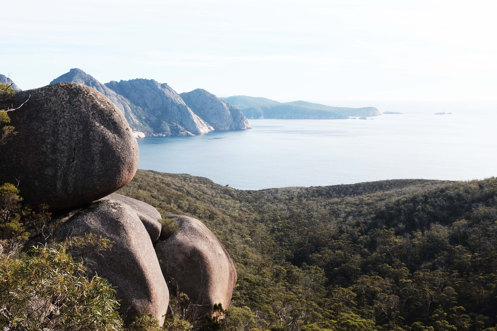
## Mt Freycinet

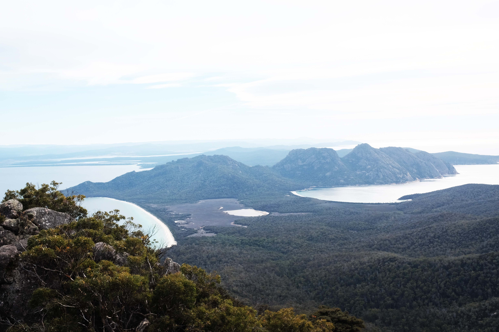
## Mt Freycinet

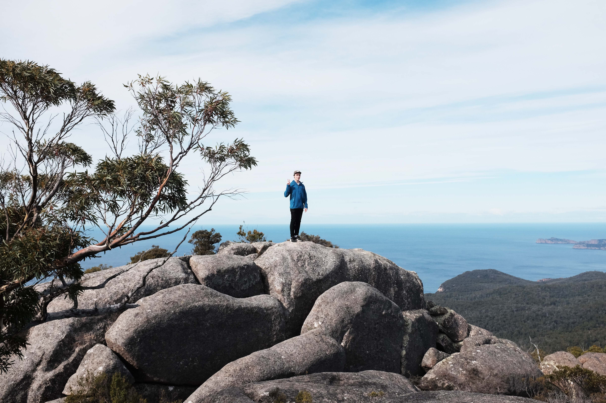
## Mt Freycinet

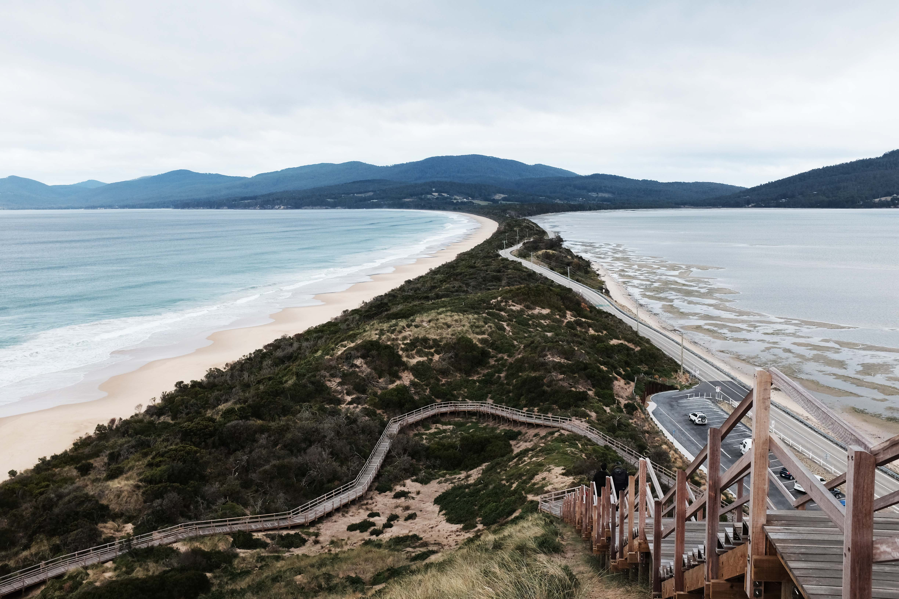
## The Neck, Bruny Island

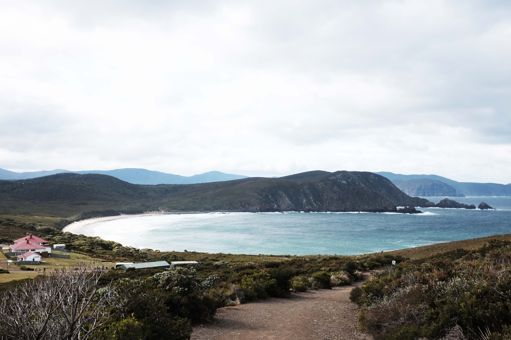
## Bruny Island

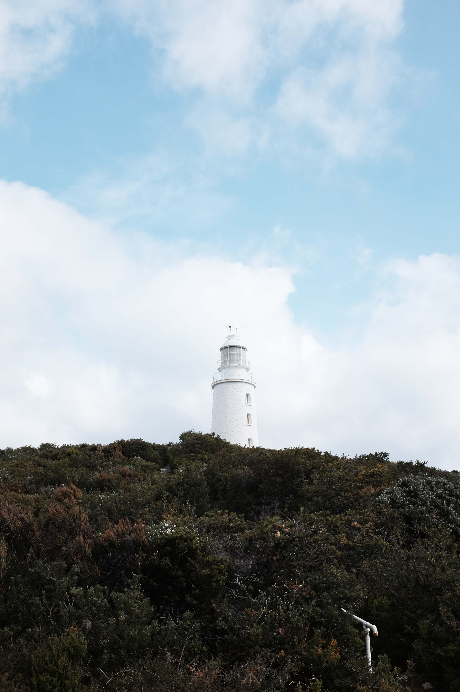
## Bruny Island

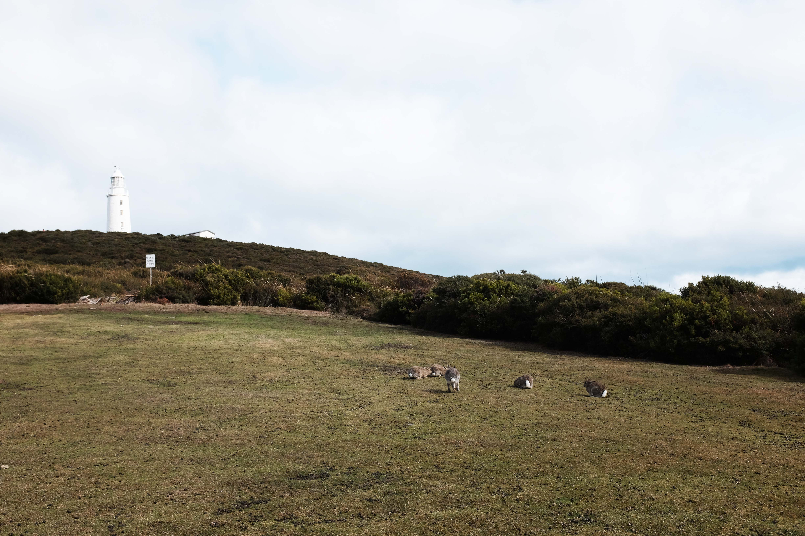
## Bruny Island
